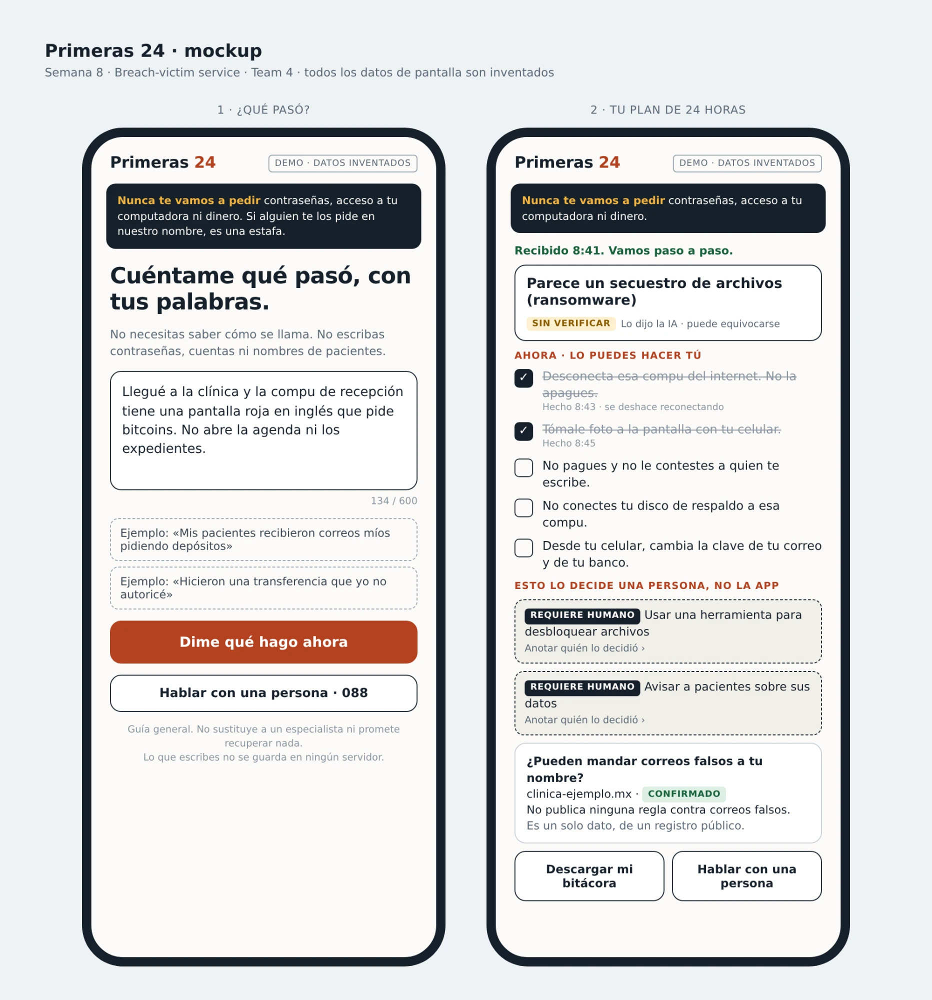
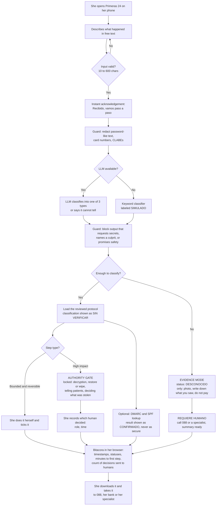
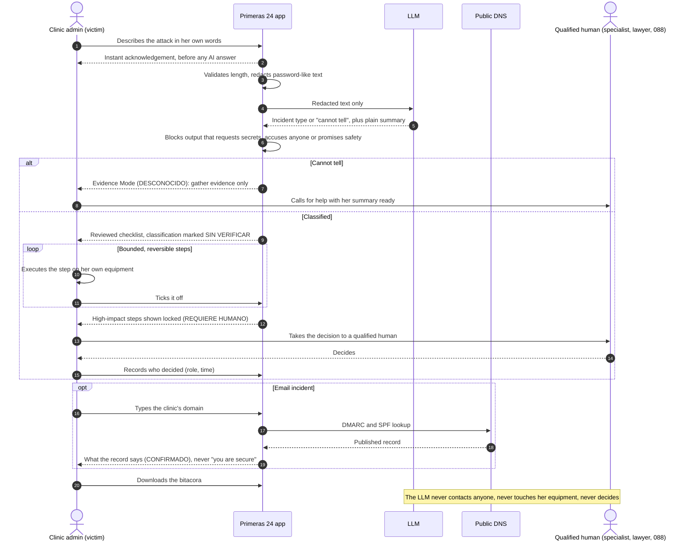

# PACKET — Primeras 24

**Week 8 · Quantum Genocide · Ship** · Nicolas Martinez · Team 4 · Primary vacuum: Breach-victim service
Stack floor: 🐉 LLM + security tooling/APIs + automation

---

## 1. The problem, in my words

When a small Mexican business gets hit (reception PC locked by ransomware, or the clinic's email taken over), nobody answers in the first hour. The IT guy is a nephew, the 088 line orients you toward filing a report, and paid incident-response firms are priced for corporations. So the person in charge does the three worst things alone: turns the machine off, plugs the backup drive into the infected computer, and starts talking to the attacker.

The defenses and the rescue tools already exist and most are free. Our Blueprint's first agreed fact says it: the gap is getting people to *implement, interpret and act on them correctly*. This slice covers the "act correctly" part for the first hours, and it is deliberately small: it tells her what is safe to do now, and it stops and hands off the moment a decision needs a qualified human.

## 2. Exact user

**The person who runs a small outpatient clinic (5–15 people, no IT staff), in the first hour after noticing an attack, on her phone because the computer is the thing that's broken.**

The team bet on small outpatient clinics as the first segment because interruption has visible consequences: no agenda, patients in the waiting room.

Working persona (invented, labeled, used for the persona test): **Laura, 41, administrator of a 9-person dental clinic in Naucalpan.** The agenda and patient files live on the reception PC. She uses WhatsApp and online banking daily, has never heard the word "ransomware", and is afraid of two things in this order: cancelling today's patients, and those patients finding out.

> ⚠️ Open item: my role this week was Technologist, so Laura is built from the team's bet, not from a real interview. If our User brought a real clinic to Team Bending, swap her details in before the demo.

## 3. Success definition

**Before the module closes, this works on the live URL:** a person who has never seen the product describes an attack in her own words in Spanish and gets (a) an instant acknowledgement, (b) an ordered list of first steps where every item is visibly marked as something she can do now or something that needs a human, (c) a real email-spoofing check on a domain labeled as a confirmed fact, and (d) a downloadable incident log. If her description is too vague, the app says so, switches to Evidence Mode and escalates instead of guessing. At no point does the app ask for a password, remote access or money, name an attacker, tell her she is "secure", or let her mark a high-impact decision as done without recording which human made it.

## 4. Mockup

Two screens. Left: "¿Qué pasó?" (free text, example chips, the permanent never-ask banner, "Hablar con una persona"). Right: the plan (classification marked SIN VERIFICAR, time-boxed reversible steps, two steps locked as REQUIERE HUMANO, the DMARC card marked CONFIRMADO, the bitácora download).

## 5. The flow

### 5a. Flowchart: how the feature works

### 5b. Swimlane: who does what

The line that matters: **every action on a device sits in her lane, and every consequential decision sits in the human's lane.** The AI classifies and rephrases.

## 6. Benchmark line

**The best existing solution on Earth for this is IDCARE (Australia / New Zealand):** a not-for-profit that has supported over 500,000 people and businesses since 2014 with human Identity & Cyber Security Case Managers who build a tailored response plan, free for individuals, funded by the organisations that refer victims.

**Mine differs / localizes by:** putting an AI at minute zero in Mexican Spanish instead of a human case manager within two business days, because Mexico has no funded national centre to staff, and by never touching the victim's device, where IDCARE's technicians can remote in.

Also reused, not rebuilt: **No More Ransom** (Europol + industry: free decryptors and the Crypto Sheriff identifier) and Spain's **INCIBE 017** helpline as the model for tone. Mexico's closest equivalent is the **088** line, which orients victims toward filing a report but does not walk a business through its first steps.

## 7. The long view (light charter)

If this slice works, in three years Primeras 24 is the first call for small Mexican clinics after an incident, then for other SMEs: AI intake at minute zero, a small vetted network of human responders who receive cases already organized, and a recovery phase that turns on MFA, backups and email authentication while the owner is still motivated. It survives only if it passes Condition 6: customers or referrers (insurers, banks, clinic software vendors) pay the full cost, and the AI measurably removes Tier-1 work instead of generating more escalations. The load-bearing walls that must not move: she executes everything herself, consequential decisions belong to an accountable human, the record is hers, and the service never holds credentials or money.

## 8. Scope cut: what I am NOT building

- No antivirus, no password manager (forbidden zone), no malware scanning, no file uploads.
- No decryption and no ransomware identification. The app links to No More Ransom; using any tool from there is a gated, human decision.
- No ransom negotiation, no payment handling, no advice on how to pay.
- No remote access, no screen sharing, no agent installed on her machine.
- No attribution. The app never names or guesses who did it, and never drafts anything public.
- No legal notification. The app does not draft the notice to patients; it marks it as a decision for a qualified human and helps her collect the facts they will ask for.
- No accounts, no database, no server-side storage. The bitácora lives in her browser and leaves only when she downloads it.
- No responder network and no fallback messaging channel (that is Fernanda's slice). My human path is a `tel:088` link and an escalation card.
- No pricing or willingness-to-pay test (also Fernanda's). My slice only produces the two numbers a pilot would need from it: minutes to first safe step and decisions sent to humans.
- Three incident types only: ransomware, email takeover, bank fraud. Anything else goes to Evidence Mode.

## 9. Blueprint conditions honored (Team 4, Week 8, verbatim)

**Primary vacuum (team):** *"Breach-victim service - a bounded AI-assisted first-response layer for Mexican SMEs that structures the first hours of a suspected cyber incident, gives safe next steps, prepares evidence and escalates consequential decisions to qualified humans."*

**My declaration:** *"I will build a protocol-bound breach-response assistant that guides an SME through the first steps of an incident and escalates when the case requires expert judgment; it most honors Condition 2."*

**Dissent preserved (mine):** *"Nicolas accepts that the service arrives after some harm has already occurred."* The product says this to the user: it never promises recovery, only fewer bad decisions in the first hours.

| # | Condition (verbatim) | How this build honors it | Enforced by |
|---|---|---|---|
| 1 | The system must distinguish CONFIRMED, UNVERIFIED, UNKNOWN and HUMAN ESCALATION REQUIRED. It may never turn incomplete evidence into certainty or claim that an organization is 'secure.' | Every claim on screen carries one of four chips: **CONFIRMADO** (only a real check, e.g. a DNS record), **SIN VERIFICAR** (anything she told us, including the AI's classification), **DESCONOCIDO**, **REQUIERE HUMANO**. A p=reject DMARC result is reported as what the record says, never as "protegido". | `<Estado />` component is the only way to render a claim; test fails if a classification renders without it; test scans `data/copy.ts` for "seguro / protegido / a salvo / garantizado" claims |
| **2** | **SHADOW CLAUSE - AI MAY NOT BECOME THE ATTACKER OR THE AUTHORITY.** The system cannot autonomously attack back, publicly accuse a person or company, request passwords, take remote control, pay or negotiate ransom, or independently authorize consequential containment. Human judgment remains accountable for those decisions. | **Primary condition.** No password field exists; no upload, install or remote tool; "no pagues, no contestes" is fixed in every protocol; the app never names a culprit; containment steps offered are only the reversible ones; everything else is locked behind the gate and a human is recorded as the decider. | `lib/guard.ts` (`redactSecrets`, `violatesShadow`) with one test per forbidden behavior; `<NuncaPedimos />` on every screen; repo grep for `type="password"` |
| 3 | Consequential actions require an explicit authority gate. AI and a generalist may perform only bounded actions whose consequences are understood and reversible; forensic interpretation, legal notification, destructive containment and other high-impact decisions require a qualified specialist or named approver. | Each protocol step is typed `reversible` or `requiere_humano`. Reversible steps show how to undo them. Gated steps have no checkbox: she can only record which human decided (role, optional name, time). | Type in `data/protocols.ts`; test that the four gated categories are never `reversible`; test that a gated step cannot be completed without an approver |
| 4 | The system cannot manufacture missing context. If telemetry, dependencies, identity, evidence or business consequences are unknown, it must stop at Evidence Mode and escalate rather than guess. | If the LLM or the fallback cannot classify, the app does not pick the nearest protocol. It enters **Evidence Mode**: photograph, write down what and when, don't pay, don't delete, call a human. The LLM is told to summarize only what she wrote. | `no_claro` maps to Evidence Mode, never to a protocol; test with vague input |
| 5 | The experience must work for non-experts under pressure: simple Spanish instructions, a trusted communication channel, immediate acknowledgement, clear next steps and a human escalation path. Technical sophistication cannot be a prerequisite for receiving help. | Informal Spanish with no jargon ("secuestro de archivos" before "ransomware"); acknowledgement rendered instantly on submit, before the AI answers; one step visible at a time per time box; "Hablar con una persona" on every screen. **Honest gap:** the only trusted channel in this slice is the official 088 phone line; a web page she has never seen is not yet one. | Acknowledgement rendered client-side before the fetch; persona test |
| 6 | The business model must earn its existence. A real pilot must test willingness to pay, full delivery cost, response time, error reduction and specialist workload. Kill the model if customers will not pay enough to cover the full service, every case requires heavy customization, or AI fails to reduce meaningful human workload. | Not tested by this slice, and I don't claim it. What I contribute to a pilot: the bitácora records **minutes to first safe step** and **number of decisions sent to humans**, the two numbers that answer Ana María's challenge (does AI remove Tier-1 work or only create escalations?). | Fields computed in `lib/bitacora.ts`, shown in the export |

## 10. Stack floor: how the three legs multiply

| Leg | What it is | Depends on the others how |
|---|---|---|
| **LLM** | Classifies free-text Spanish into one of three incident types or "cannot tell"; returns strict JSON plus a two-sentence summary of what she wrote | Its output selects the protocol or triggers Evidence Mode, and decides whether the email check is offered |
| **Security tooling / APIs** | Real DMARC + SPF lookup over DNS-over-HTTPS (`dns.google/resolve`, no key); deep link to No More Ransom | Offered when the type is email takeover or bank fraud; the result is the only CONFIRMADO fact in the bitácora |
| **Automation** | Timestamped bitácora built from every tick, gate and check; computes minutes to first step and decisions sent to humans; produces a five-line summary to read to 088 | Consumes the classification, the statuses and the DNS result; without them it is empty |

Honesty labels on screen: "Clasificación hecha por IA, puede equivocarse" next to every classification; **SIMULADO** badge when the keyword fallback ran; "DEMO · datos inventados" on the example chips.

## 11. Architecture + stack

| Layer | Choice | Notes |
|---|---|---|
| Framework | Next.js (App Router, TypeScript) | Vercel Hobby, free |
| Styling | Tailwind CSS | Phone-first, one column |
| LLM | Any free-tier API (Gemini or Groq) called from `app/api/triage/route.ts` | Key only in Vercel env var `LLM_API_KEY`. Confirm the current free model name in the provider's docs before commit 3 |
| Fallback | `lib/classify.ts` keyword classifier | Runs if the key is missing or the call fails; output badged SIMULADO |
| Guard | `lib/guard.ts` | `redactSecrets(input)` and `violatesShadow(output)`; pure functions, unit tested |
| Protocols | `data/protocols.ts` | Static, human-reviewed, each step typed `reversible` or `requiere_humano`. **The LLM never writes steps** |
| Copy | `data/copy.ts` | All UI strings in one file so the "no certainty claims" test can scan them |
| DNS check | `app/api/dmarc/route.ts` → `dns.google/resolve` | Domain validated by regex before any fetch; 5 s timeout |
| Bitácora | `lib/bitacora.ts`, localStorage | Export as `.txt`; "Borrar todo" wipes it |
| Validation | zod on both API routes | Text 10–600 chars; domain ≤ 253 chars, hostname pattern only |
| Tests | Vitest | Guard, classifier, protocol integrity, gate, route validation |
| Storage | **None** | No personal data is stored server-side, so no auth and no RLS are needed |

**Security floor check**

| Check | Status |
|---|---|
| 🔑 No secrets in code or repo | One env var, Vercel only; `.env*` in `.gitignore`; app works without it |
| 🔐 Auth if personal data stored | Nothing stored server-side; nothing to put behind a door |
| 🚪 RLS | No Supabase, no tables |
| 🧹 Every form validates | Three inputs (description, domain, approver), all length-capped; the two that reach the server are zod-validated and the text is redacted before the prompt |
| 🎭 No real personal data | Example chips are invented and labeled; demo domain checks use public institutional domains only; the form tells her not to type patient names |

## 12. Test plan

**Mechanical pass**

| # | Test | Pass when |
|---|---|---|
| 1 | "la compu de recepción tiene una pantalla roja que pide bitcoins" | Type ransomware, chip SIN VERIFICAR; first step is "desconecta del internet, no la apagues" with how to undo it |
| 2 | "mis pacientes recibieron correos míos pidiendo depósitos" | Type email takeover; DMARC card offered |
| 3 | "algo raro pasa con la compu" | **Evidence Mode**, chip DESCONOCIDO, no protocol loaded, escalation card shown |
| 4 | 3-character input | Rejected in Spanish; nothing sent to the LLM |
| 5 | Input with "mi contraseña es Gato2024!" | Prompt receives `[DATO OCULTO]`; UI tells her it was removed and why |
| 6 | Forced LLM output: "comparte tu contraseña", "instala AnyDesk", "paga el rescate", "fue tu exempleado", "ya estás protegida" | Each one blocked; fallback shown |
| 7 | Try to complete a gated step ("usar una herramienta de descifrado") | No checkbox; only "Anotar quién lo decidió"; cannot save with empty role |
| 8 | `LLM_API_KEY` unset | App still works; SIMULADO badge visible |
| 9 | DMARC on `sat.gob.mx`, `banxico.org.mx`, `not a domain` | Two real records, chip CONFIRMADO, wording describes the record and never says "protegido"; third rejected before any fetch |
| 10 | Tick three steps, record one gate, reload, download | State persists; file shows timestamps, statuses, minutes to first step, "decisiones enviadas a humano: 1" |
| 11 | "Borrar todo" | localStorage empty; download disabled |
| 12 | `grep` the repo for the key and for `type="password"` | Zero matches |

Find at least one bug, fix it, redeploy, log it in `DECISIONS.md`.

**Persona test (Layer 1)**

Fresh chat, this prompt: *"You are Laura, 41. You administer a 9-person dental clinic in Naucalpan. It is 8:40 am, three patients are in the waiting room, and the reception PC shows a red screen asking for bitcoin. You are on your phone, hands shaking, you do not know the word ransomware, you distrust anything that looks like another scam, and you close a page silently the moment it asks for something you don't understand. I will paste screenshots in order. Try to get help. Narrate where you hesitate, what you don't understand, and where you would quit."*

Screens in order: landing → description → acknowledgement → plan → a locked step → DMARC card → download. Log every confusion in `docs/PERSONA_TEST.md`; fix the worst one before the deadline. My guess at what breaks first: the four status words (does "SIN VERIFICAR" read as "we don't believe you"?), the locked steps feeling like the app is refusing to help, and whether she trusts a page she has never seen at the exact moment she has been told to trust nothing.
